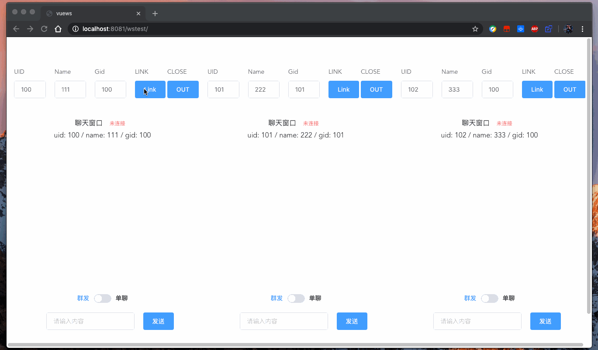

## GOWS


> a simple ws program in go
> 这只是个demo，不建议生产使用，有的地方还需优化，，，，，


* 可以聊天
* 用户身份验证
* 群组聊天
* 消息通知
* 添加简单演示页面


> 说明

```shell
$ go  run main.go -h
Usage of /var/folders/0z/d90ql8410qvd6pf8vcsdzbxc0000gn/T/go-build984855082/b001/exe/main:
  -h	this help
  -u string
    	if you set the value, app will check token with it
    	    this api must be:    https: / http:// {{host}}:{{port}}/XXXXX

    	    app will request  https: / http:// {{host}}:{{port}}/XXXXX?token=XXXXXXX


    	    you must response

    	    {
    	      status: int,    ## 0:ok 1:error
    	      gid:    string,
    	      name:   string,
    	      uid:    string,
    	    }

```


App —> Group —> Client

全局 —>   群组  —>    成员


成员只允许在群内聊天，成员拥有 群发，和群内单聊权限

全局可以通过https/http触发通知 

当用户解析的token内不含有gid记录时，默认在ALL群，即公开群，可以当做是一个大群


[API文档](server/param.md)



